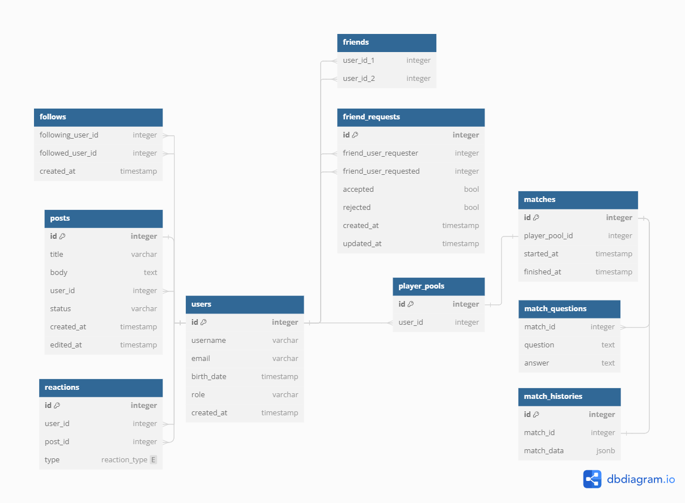

# GPT Trivia Metadata Database

This repo contains the Database change management for the GPT Trivia metadata DB.

## Tech stack

- [PostgreSQL](https://www.postgresql.org/)
- [Sqitch](https://sqitch.org/)

## Schema

